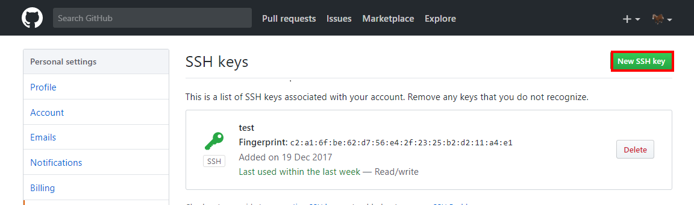
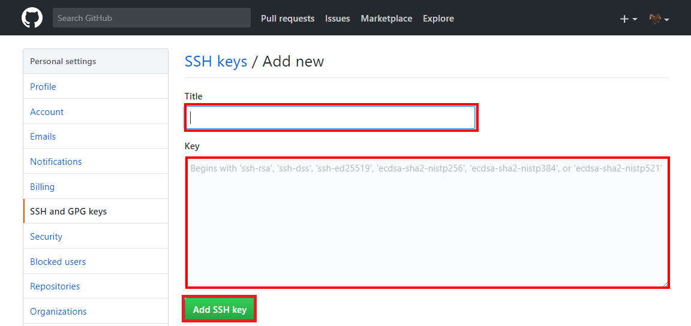

# githubのSSH設定
## sshキー作成
- ssh-keygen -t rsa -b 2048 -C "メールアドレス"

## githubにsshキー登録
- [Settings > SSH and GPG keys](https://github.com/settings/keys)にアクセス
- 「New SSH key」を押下


- 「Title」、「Key」入力し、「Add SSH key」を押下


## ~/.ssh/config作成
- Port443,プロキシ経由でgithubにssh接続する設定
- 「C:\Program Files\Git\mingw64\bin\connect.exe」にPathが通ってない場合は通す
- 「connect.exe」はGit for Windowsをインストールしていればある
```
# ~/.ssh/configの中身
Host github.com
  User git
  HostName ssh.github.com
  Port 443
  ProxyCommand connect -H プロキシ名:ポート番号 %h %p
```

## 動作確認
- `ssh -T github.com`で、接続可能か確認  


- `git clone SSHのリポジトリ名`で、リポジトリの取得が可能か確認  


- `git push`で、リポジトリのアップロードが可能か確認  

